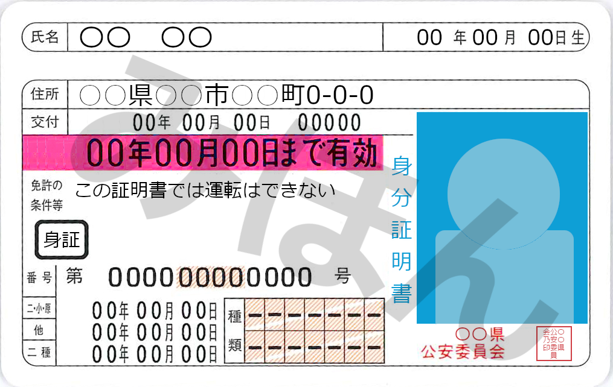

# 「ゼロビット免許証」提言書

## 提言の目的

現行のマイナンバーカード制度が抱える、非効率性、不公平性、そして国民の不信感といった根本的な問題を解決するため、誰もが安心・便利に利用できる新しい身分証明書制度として「ゼロビット免許証」の導入を提言します。

## 提言の背景：マイナンバーカード制度の根本的な矛盾と「見せかけの普及率」

マイナンバーカードは、その手続きの煩雑さから多くの国民に負担を強いています。その結果、普及率は78%に達したとされますが、これは**これまでの苦労を無視し、今後生まれてくる子どもたちにも同じ負担を強いる**ことになります。

1.  **手続きの非効率性**
    運転免許証は、**書類記載と住民票、顔写真の提出で即日交付**が可能です。しかしマイナンバーカードは、同じく住民票と顔写真が必要であるにもかかわらず、**申請から受け取りまでに数ヶ月**を要し、しかも**窓口での対面交付**を原則としています。これは、国民の利便性を無視した、極めて非効率的な制度設計です。

2.  **既存インフラへの「寄生」**
    マイナンバーカードの交付手続きでは、**免許証などの身分証明書類の提示が必須**です。これは、マイナンバーカードが、すでに社会に浸透している既存の身分証明書に依存していることを示しています。誰もが持てるはずの身分証明書が、別の身分証明書がなければ取得できない、という矛盾に満ちた状況です。

3.  **縦割り行政の弊害**
    マイナンバーカードのシステムは、多額の税金を投じて構築されましたが、免許証を管理する警察庁などとの連携が不十分です。これは、**「デジタル化」という名の下に、アナログな縦割り行政が温存されている**証拠であり、制度の根本的な欠陥と言えます。

## 提言内容：「ゼロビット免許証」の導入

上記の問題を解決するため、現在の運転免許証の仕組みを応用した**「ゼロビット免許証」**制度の導入を提言します。

**ゼロビット免許証**とは、**ICチップを搭載せず、運転できる車両種別の欄がまったく埋まっていない、国民全員が持てる顔写真付きの公的な身分証明書**です。免許証としては濃いピンク色の帯となります。

これにより、以下のメリットが実現します。

1.  **誰も取り残さない公平な制度**
    既存の運転免許センターのインフラを活用することで、**赤ちゃんから高齢者まで、すべての国民が即日かつ公平に身分証明書を手に入れることができます**。これにより、マイナンバーカードの取得をためらう人々や、今後生まれてくる子どもたちが、身分証明の手段に困ることがなくなります。

2.  **国民の負担と税負担の軽減**
    ICチップを搭載しないため、情報漏洩のリスクを最小限に抑えられます。また、多額の税金を投じて新たなシステムを構築する必要がなく、国民の税負担を大幅に軽減できます。

3.  **役割の明確化と効率化**
    ゼロビット免許証を**「身分証明」**に特化させ、マイナンバーカードを**「電子証明」**に特化させることで、それぞれの役割が明確になります。これにより、国民は目的に応じて使い分けることができ、行政は既存のインフラを効率的に活用できます。

## **普及率78%という批判への反論**

[「普及率が78%に達したのだから、制度は成功した」](https://www.soumu.go.jp/kojinbango_card/kofujokyo.html)という批判に対し、以下の点で反論します。

* **普及率の裏にある苦労**: この78%という数字は、多くの国民が、不便で時間のかかる手続きに耐え、行政の不手際によるトラブルを経験した上で得られたものです。これは成功ではなく、国民が支払った犠牲の上に成り立っています。
* **未来への負担**: 普及率が高いからといって、これから生まれてくる子どもたちや、まだカードを持っていない人々が、同じ苦労を繰り返すことは正当化されません。真に優れた制度は、誰にとっても公平で、手間がかからないものであるべきです。
* **「見せかけの普及率」**: 従来の健康保険証の廃止という**事実上の強制**によって普及率が上がった側面が強く、国民が心から便利だと感じて自発的に取得した結果ではありません。

## 結論：国民の利益を最優先にした制度を

マイナンバーカードの取得に際する煩雑さの解決の糸口として、「ゼロビット免許証」の提言をいたしました。

「ゼロビット免許証」は、納税者の負担を最小限に抑えつつ、国民の安全と利便性を最大化できる、極めて現実的かつ効果的な解決策です。この提言が、国民の声を代弁し、本当に必要な制度へと日本社会が進むきっかけとなることを心より願います。